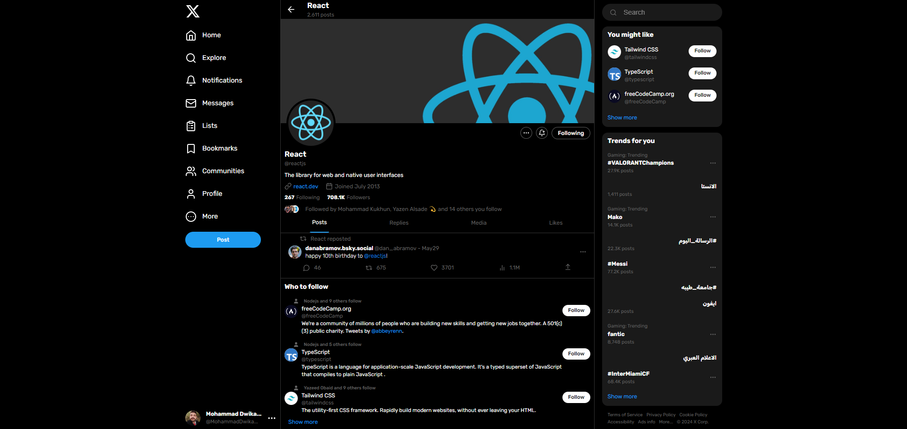

    
    

## Twitter React Profile

An Implementation of React profile on Twitter

## Libraries Used

In this project, I've used the following libraries:

- **mui/material**: Offers Material Design UI components for a consistent and modern interface. [mui/material](https://mui.com/)
- **Font Awesome:** A popular icon set and toolkit for adding vector icons and social logos. [Font Awesome](https://fontawesome.com/)
- **tailwindcss**: A utility-first CSS framework for rapid and responsive UI development. [tailwindcss](https://tailwindcss.com/)
- - **react-lucid**: A set of clear and elegant React icons for building visually appealing interfaces. [react-lucid](https://www.npmjs.com/package/react-lucid)

Please refer to the documentation of each library for more information on how to use them.

## Live Preview

<h4 align="left">Live Preview is available at https://twitter-react-profile-9yi3.onrender.com/</h4>

